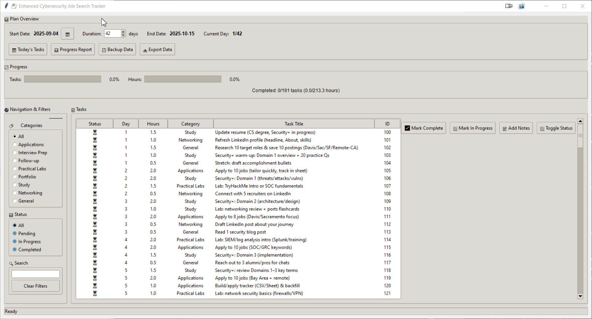
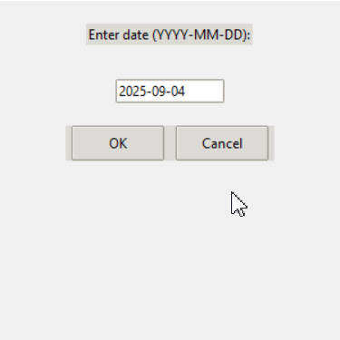
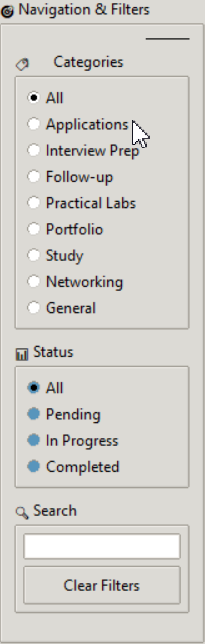
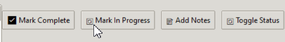
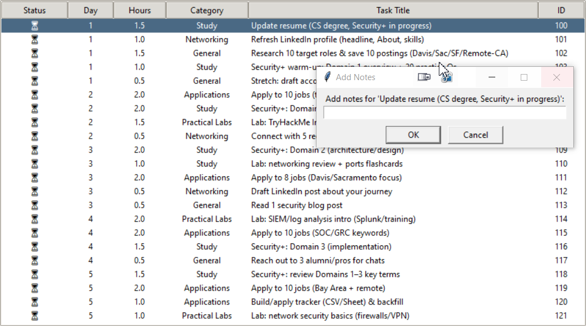
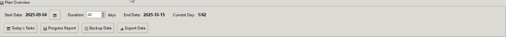

# Career Development Plan Tracker

A comprehensive desktop application for managing structured schedules and career development plans. Supports any field with customizable templates and detailed planning guides - perfect for job search, learning new skills, or achieving any goal.


## Features

- **Customizable Plans** - Support for any field (cybersecurity, data science, web dev, etc.)
- **Custom Plan Generation** - Use provided templates to create personalized plans
- **Modern GUI** - Beautiful interface with progress visualization
- **Advanced Filtering** - Filter by category, status, or search terms
- **Progress Tracking** - Visual progress bars and detailed reports
- **Data Management** - Automatic backups and export capabilities
- **Template System** - Easy-to-use templates for different career paths
- **Privacy-First** - Personal data files are automatically gitignored

## Perfect For

### **Career Development**
- **Job Search** - Application tracking, interview prep, networking
- **Career Transitions** - Skill building, certification prep, portfolio development
- **Professional Growth** - Learning new technologies, soft skills, leadership

### **Field-Specific Plans**
- **Cybersecurity** - Security+, CEH, CISSP, hands-on labs, job applications
- **Software Development** - Full-stack, mobile, DevOps, system design
- **Data Science** - Python, R, machine learning, statistics, visualization
- **Web Development** - Frontend, backend, full-stack
- **DevOps** - Cloud platforms, automation, infrastructure
- **UX/UI Design** - Design tools, user research, portfolios
- **Mobile Development** - iOS, Android, cross-platform
- **Game Development** - Unity, Unreal, indie development
- **Data Science** - Machine learning, deep learning, data analysis
- **Fitness** - Workout plans, nutrition, health goals
- **Language Learning** - Vocabulary, grammar, conversation practice
- **Education** - Study schedules, exam preparation, skill building
- **Business** - Marketing, sales, entrepreneurship, project management

## Quick Start

### Installation
```bash
# Clone the repository
git clone https://github.com/jacobdcook/career-development-tracker.git
cd career-development-tracker

# Run the application
python enhanced_cybersecurity_tracker.py
```

### Key Features
- **Flexible timeline** - 7 to 365 days supported (any duration)
- **Interactive calendar picker** - Click to select start date
- **Customizable hours** - Adjust daily targets to your schedule
- **Real-time progress tracking** with completion percentages
- **Export capabilities** (CSV and JSON formats)
- **Automatic backups** with timestamped files
- **Cross-platform** - Windows, macOS, Linux

**Note**: Your personal schedule file is automatically gitignored and will never be uploaded to GitHub

### Daily Workflow
1. **Set your start date** by clicking the calendar icon
2. **Adjust duration** using the spinbox (7-365 days)
3. **Set daily hours** target (1-12 hours)
4. **Start tracking** your progress by marking tasks complete
5. **Add notes** to document your progress and insights
6. **Export data** for external analysis or backup
7. **Create backups** before major changes

### Creating Custom Plans
1. **Read the schedule generator guide** in `schedule_generator_guide.md`
2. **Customize the prompt** for your field and goals
3. **Generate your plan** using the provided templates and prompts
4. **Save the JSON output** as `my_schedule.json`
5. **Launch the application** to start tracking your progress

## Screenshots

### Main Application Interface

*The main application window showing the comprehensive task management interface with plan overview, progress tracking, and task list.*

### Calendar Date Picker

*Interactive calendar widget for selecting your start date with fallback support for older Python versions.*

### Navigation and Filtering

*Advanced filtering options including category selection, status filtering, and real-time search functionality.*

### Task Actions

*Task management interface showing completion status, notes, and quick action buttons.*

### Task Notes Dialog

*Dialog for adding detailed notes to specific tasks.*

### Plan Overview Section

*Top section showing plan details including start date, duration, end date, and current progress.*

## Technical Details

### Architecture
- **Python 3.7+** with tkinter for GUI
- **JSON-based** data storage
- **Modular design** with separate classes for tracker and GUI
- **Cross-platform** compatibility
- **No external dependencies** required

### File Structure
```
career-development-tracker/
├── enhanced_cybersecurity_tracker.py    # Main application
├── sample_schedule_template.json        # Template for custom plans
├── schedule_generator_guide.md          # Plan generation templates
├── cybersecurity_job_plan.py            # Original CLI version
├── run_enhanced_tracker.bat             # Windows launcher
├── demo.py                             # Feature demonstration
├── requirements.txt                     # Dependencies
├── README.md                            # This file
├── LICENSE                              # MIT License
├── screenshots/                         # Application screenshots
└── releases/                           # Release packages
```

## License

This project is licensed under the MIT License - see the [LICENSE](LICENSE) file for details.

## Acknowledgments

- Built with Python's standard library for maximum compatibility
- Inspired by the growing need for structured career development tools
- Template system designed for maximum flexibility and customization
- Planning templates for easy plan generation

## Support

If you find this tool helpful, please consider:
- Starring the repository
- Opening an issue for bugs or feature requests
- Contributing to the project
- Sharing with others who might benefit

## Contributing

Contributions are welcome! Please read our [Contributing Guide](CONTRIBUTING.md) for details on our code of conduct and the process for submitting pull requests.

---

**Ready to start your career development journey? Download, extract, and begin tracking your progress today!**